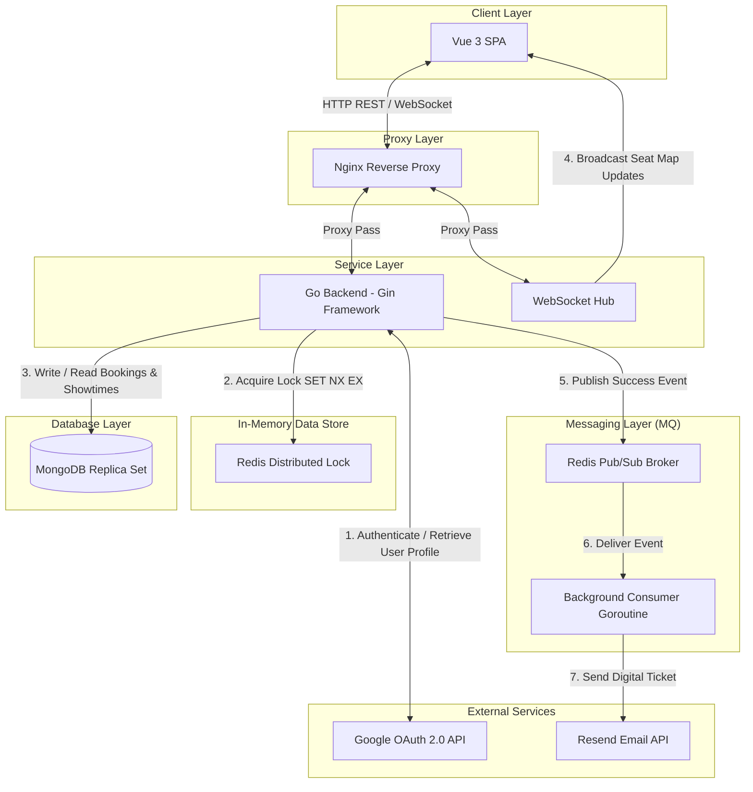
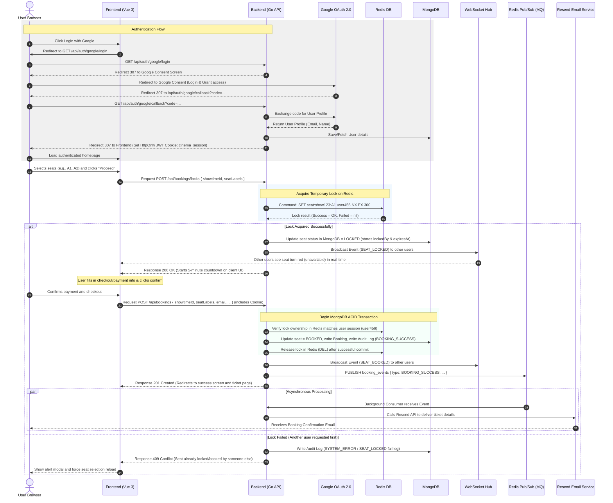

# Cinema Ticket Booking System

A high-concurrency, full-stack online cinema ticket booking system designed to prevent double bookings using a **Distributed Lock (Redis)** and provide a real-time seat map updated via **WebSockets**. The system features **Google OAuth 2.0** authentication, strict **Role-Based Access Control (RBAC)**, transaction-bound synchronous audit logging, and asynchronous ticket-confirmation emails via a **Message Queue (Redis Pub/Sub)**.

---

## 1. System Architecture Diagram



### Component Breakdown
1. **Frontend (Vue 3 SPA + Nginx)**: Client-side single page application built with Vue 3 Composition API and Pinia for state management. Nginx acts as a web server and reverse proxy handling API calls and WebSocket connections.
2. **Backend (Go + Gin Framework)**: A high-performance API server written in Go. Leverages Gin for routing and Go's native concurrency model (Goroutines) to handle large loads efficiently.
3. **Database (MongoDB Replica Set)**: Persistent storage for movies, showtimes, bookings, and audit logs. Utilizes MongoDB Replica Set transactions to guarantee ACID compliance for checkout operations.
4. **Cache & Distributed Lock (Redis)**: Prevents double booking under high concurrent traffic using fast in-memory key checks.
5. **Message Queue (Redis Pub/Sub)**: Serves as an asynchronous event broker to dispatch background jobs (such as sending emails) without blocking user requests.
6. **External Authentication (Google OAuth 2.0)**: Authenticates user identity to issue secure JWT credentials, supplying the required `userId` for booking seat claims.
7. **External Email API (Resend)**: Sends reservation details and digital tickets to users asynchronously upon successful booking.

---

## 2. Tech Stack Overview

| Layer / Service | Technology | Description |
| :--- | :--- | :--- |
| **Frontend UI** | Vue 3 (Composition API), Vite, Pinia, Vue Router, Vanilla CSS | Premium dark-themed, glassmorphism UI. Clean component structure and centralized reactive state management. |
| **Backend Core** | Go (Golang) 1.25, Gin Framework | Fast execution, lightweight footprint, and efficient concurrency management out of the box. |
| **Authentication** | Google OAuth 2.0 & JWT | Secure identity provider. Generates JSON Web Tokens (JWT) stored in a secure, HttpOnly cookie to identify users. |
| **Role Enforcement**| Custom RBAC Middleware | Decodes JWT claims to restrict endpoints based on roles (`USER` vs `ADMIN`). Blocks standard users from calling Admin APIs. |
| **Real-time Engine** | Gorilla WebSocket | Full-duplex real-time communication channel to broadcast seat updates instantly. |
| **Database** | MongoDB 7.0 (Replica Set) | Schema-flexible document database. Supports transaction boundaries for robust multi-document checkout safety. |
| **In-Memory Lock** | Redis 7.4 | Lightweight distributed lock driver. Avoids high-latency database locks during peak requests. |
| **Message Queue** | Redis Pub/Sub | Fire-and-forget message broker mechanism for decoupling slow workflows. |
| **Email Service** | Resend API | Developer-friendly email delivery platform used to dispatch transactional confirmation receipts. |
| **Containerization** | Docker, Docker Compose | Fully automated multi-container orchestration for consistency across environments. |
| **Testing Suite** | Playwright (E2E), Vitest (Frontend), Native Go Testing Package (Backend) | Robust test coverage checking edge cases, timeout policies, and concurrent booking race conditions. |

---

## 3. Step-by-Step Booking Flow

The booking process is split into the following steps:

### Sequence Diagram


### Detailed Steps Description
1. **Google OAuth Login**: The user logs in via Google OAuth. The backend callback registers them in MongoDB, signs a JWT (containing `userId`, `email`, and `role`), and returns it to the browser inside a secure, HttpOnly cookie named `cinema_session`.
2. **Seat Selection**: The client loads the seat map. Available seats are green. Clicking seats and hitting "Proceed" starts the hold lock step.
3. **Lock Hold Request**: A POST request to `/api/bookings/locks` (automatically sending the `cinema_session` cookie) attempts to lock the requested seats.
4. **Redis Lock Attempt**: Backend runs an atomic `SET NX` command. If the lock is acquired, the backend persists the status `LOCKED` in MongoDB, writes a `SEAT_LOCKED` audit log entry, and broadcasts it via WebSocket so all active viewers see the seat turn red instantly.
5. **Checkout Countdown**: The user has exactly 5 minutes (300 seconds) to complete the details. If they fail to checkout or navigate away, the lock expires automatically, and the seats become `AVAILABLE` again.
6. **Checkout Confirmation**: The user submits payment details. The system boots an ACID transaction in MongoDB, validates that the lock belongs to this user, updates the status to `BOOKED`, writes a `BOOKING_SUCCESS` audit log entry, deletes the temporary Redis lock, and publishes a success event to Redis Pub/Sub.
7. **Asynchronous Notification**: The background consumer intercepts the published message and sends the digital ticket via Resend API. The user receives their email confirmation asynchronously without delay.

---

## 4. Redis Lock Strategy

To handle high-concurrency bookings, we implement a **Distributed Lock** strategy in Redis combined with database-level safety checks.

### Acquiring the Lock
The system uses the following Redis command:
```
SET seat:{showtimeId}:{seatLabel} {userId} NX EX 300
```
- **Key Schema**: uniquely maps to a seat in a specific showtime.
- **Value**: The current user's ID, which guarantees that only the owner of the lock is authorized to release it or complete the booking.
- **NX (Not Exists)**: Only sets the key if it doesn't already exist. This prevents race conditions where multiple users try to select the same seat at the same time.
- **EX 300 (TTL)**: Auto-expires the key in 5 minutes (300 seconds). This acts as a circuit-breaker to clean up locks if a user abandons their checkout or loses connectivity, preventing permanent deadlocks.

### Dual-Layer Safety Net
To secure the database against any Redis data loss or network partitions, we use a two-tiered check:
1. **First Tier (Redis - Fast Path)**: Filters out concurrent requests immediately at the memory layer with sub-millisecond response times.
2. **Second Tier (MongoDB - Atomic Net)**: During checkout, seats are updated using atomic MongoDB modifiers (`$set` under filters matching `status: AVAILABLE` or `status: LOCKED` by the current user) inside a multi-document transaction. This ensures that even if Redis goes down, double-booking is physically impossible at the database tier.

---

## 5. Message Queue & Audit Logging Strategy

We utilize **Redis Pub/Sub** as a lightweight **Message Queue / Event Broker** to optimize API response times, separating asynchronous workflows from secure synchronous audit logging.

### Asynchronous Message Queue
- **Workload Separation**: Sending emails requires executing HTTP requests to third-party endpoints (Resend API), which can take 1–3 seconds due to network overhead. Blocking the HTTP response for email delivery degrades user experience.
- **Instant Response**: Upon successful database transaction commit, the API server publishes a `BOOKING_SUCCESS` message to the `booking_events` channel in Redis Pub/Sub and returns a `201 Created` payload back to the client immediately (< 20ms).
- **Background Consumer**: A dedicated subscriber goroutine listens for the channel messages, extracts the payload, and executes the external Resend API call in the background.

### Synchronous Audit Trail Logs
Unlike email notifications, **Audit Logs are written synchronously** directly to MongoDB to guarantee audit trail durability and compliance. The system logs at least **4 distinct event categories**:

1. **`BOOKING_SUCCESS`**: Logged synchronously inside the MongoDB ACID transaction during checkout. This ensures a booking cannot succeed without its corresponding audit log being successfully saved.
2. **`BOOKING_TIMEOUT`**: Logged by the background `LockExpiryScheduler` loop when temporary seat locks expire (every 30 seconds). It frees expired seats in MongoDB, clears the Redis lock, and creates a `BOOKING_TIMEOUT` audit log containing the original expiration timestamp.
3. **`SEAT_RELEASED`**: Logged synchronously when a user manually deselects/cancels a locked seat before checking out, which releases the seat back to `AVAILABLE`.
4. **`SYSTEM_ERROR` / `SEAT_LOCKED` (Failed hold)**: Logged synchronously when a Redis/DB error occurs, or when a user tries to lock an already locked seat, recording details of the conflict for troubleshooting.

---

## 6. Authentication & Role-Based Access Control (RBAC)

The system implements strict role enforcement to protect admin interfaces and restrict standard users from accessing backend management routes.

### Google OAuth 2.0 & Session Management
- **Login Initiation**: User requests `GET /api/auth/google/login`, which redirects them to Google's OAuth consent screen.
- **Callback Processing**: Google redirects back to `GET /api/auth/google/callback` with an authorization code. The backend exchanges this code for the user profile, creates/updates the user record in MongoDB, and generates a signed JWT token.
- **Session Storage**: The JWT token is sent back as a secure, `HttpOnly`, `SameSite=Lax` cookie named `cinema_session`, protecting it from XSS attacks.

### Middleware & Role Verification
The Go backend registers routes under separate route groups with dedicated middleware:
- **Authentication Middleware (`middleware.AuthMiddleware`)**: Validates the JWT in the `cinema_session` cookie for all protected user and admin endpoints. It decodes the claims (`userId`, `email`, `role`) and injects them into the Gin context.
- **Role Enforcement Middleware (`middleware.RequireRole`)**: Applied to all admin endpoints. It checks that the active role is `ADMIN`. If a standard user tries to access admin-restricted endpoints, it returns `403 Forbidden` immediately, terminating the request.
- **Switch Role Endpoint (`POST /api/auth/switch-role`)**: Allows admin users to toggle their session token's active role between `ADMIN` and `USER` for testing permissions. Standard users are blocked from switching their role to `ADMIN`.

---

## 7. Admin Dashboard & Management Features

The system implements a dedicated Admin Panel allowing administrators to monitor sales, audit logs, and manage movies.

- **Bookings Management**: Accesses `GET /api/bookings` to view all reservations. Supports pagination, searching, and filtering by movie title and booking status (`CONFIRMED`, `PENDING`, `CANCELLED`, `EXPIRED`).
- **Audit Logs View**: Accesses `GET /api/audit-logs` to query system logs, filterable by event category (e.g. `BOOKING_SUCCESS`, `BOOKING_TIMEOUT`).
- **Dashboard Stats**: Accesses `GET /api/bookings/stats` to retrieve aggregation metrics (ticket counts and total revenue grouped by movie title).
- **Movie Creation & Automatic Showtime Seeding**: Accesses `POST /api/movies` to register new movies. Admin can provide optional parameters `halls` (e.g., `["Hall A", "Hall B"]`) and `slots` (e.g., `["Morning", "Afternoon", "Evening", "Night"]`) to automatically generate showtimes and full seat maps for the next 5 days.

---

## 8. How to Run the System

### Prerequisites
- **Docker** and **Docker Compose** installed.
- (Optional for manual execution) **Node.js (v18+)** and **Go (v1.25+)**.

---

### Running via Docker Compose (Recommended)

1. Copy the environment variables template:
   ```bash
   cp .env.example .env
   ```
2. Configure `.env` with your settings (especially `RESEND_API_KEY`, `ADMIN_EMAIL`, and `ADMIN_PASSWORD`).
3. Build and launch all services:
   ```bash
   docker compose up --build
   ```
4. Access the applications:
   - **Frontend (Vue 3 Client)**: [http://localhost](http://localhost) (Port 80)
   - **Backend API Server**: [http://localhost:8080](http://localhost:8080) (Proxied through port 80 at `/api`)

---

### Local Development Mode (Hot Reload)

To test code changes in real-time, run the database and cache services in Docker, and the app code locally:

1. **Spin up MongoDB and Redis**:
   ```bash
   docker compose up mongodb redis
   ```
2. **Start Go Backend**:
   ```bash
   cd backend
   cp .env.example .env
   go run cmd/main.go
   ```
3. **Start Vue Frontend**:
   ```bash
   cd frontend
   npm install
   npm run dev
   ```
   - Access the development environment at [http://localhost:5173](http://localhost:5173) (Vite proxies requests to `:8080` automatically).

---

### Running Tests

#### 1. Backend Tests (Unit & Integration)
To run the Go backend test suites (ensure Redis and MongoDB replica sets are running):
```bash
cd backend
go test ./...
```
*To test the high-concurrency lock behavior specifically (simulates 10 concurrent requests for the same seat):*
```bash
go test ./internal/booking -run TestRedisLockAllowsOnlyOneConcurrentOwner -v
```

#### 2. Frontend Unit Tests
To execute frontend component unit tests via Vitest:
```bash
cd frontend
npm run test:unit
```

#### 3. E2E Tests (Playwright)
To execute browser simulation tests (ensure both backend and frontend dev server are active):
```bash
cd frontend
npx playwright test
```

---

## 9. Assumptions & Trade-offs

### Project Assumptions
1. **Auto-Seeding**: The system assumes an empty database on first startup and automatically seeds the MongoDB database with 2 theaters (Hall A with 30 seats, Hall B with 40 seats), 5 movies, and 3-4 randomized showtimes per movie for the next 5 days.
2. **Grid Layout**: The seat grid is a fixed 2D layout mapped to rows A–F with pre-configured prices (Front, Middle, Back).
3. **Resend API Sandbox**: Default configuration assumes a free tier/sandbox key from Resend, which requires verified email addresses for outbound emails.

### Architectural Trade-offs

| Component / Choice | Selected Approach | Pros | Cons / Mitigations |
| :--- | :--- | :--- | :--- |
| **Real-time Event Distribution** | **In-Memory WebSocket Hub (Goroutines)** | Extremely low latency. Lightweight implementation since it runs inside the backend's memory space. | **No Horizontal Scaling**: If the backend is scaled to multiple nodes behind a load balancer, clients on different servers won't receive cross-node updates. *(Mitigation: Would require Redis Pub/Sub to sync WebSocket events across multiple nodes).* |
| **Email Queue Driver** | **Redis Pub/Sub** | Zero overhead. No need to install and configure heavy brokers (like RabbitMQ) since Redis is already part of the stack. | **Fire-and-Forget (No Persistence)**: If a backend node crashed while a message was published, that message is lost. *(Mitigation: For higher reliability, upgrade to Redis Streams or RabbitMQ to support persistent task delivery).* |
| **Database Transaction Engine** | **Single Node MongoDB Replica Set** | Enables full support for multi-document ACID transactions for booking confirmation steps. | Requires managing replica set configurations instead of a simple standalone mongo instance. |
| **Concurrency Safeguard** | **Redis Lock + Database Constraint Check** | Optimal throughput by deflecting rapid lock requests on Redis, while ensuring absolute transaction safety. | Higher write latency during checkout commit due to two distinct network hops (Redis release + Mongo Transaction). |

---
