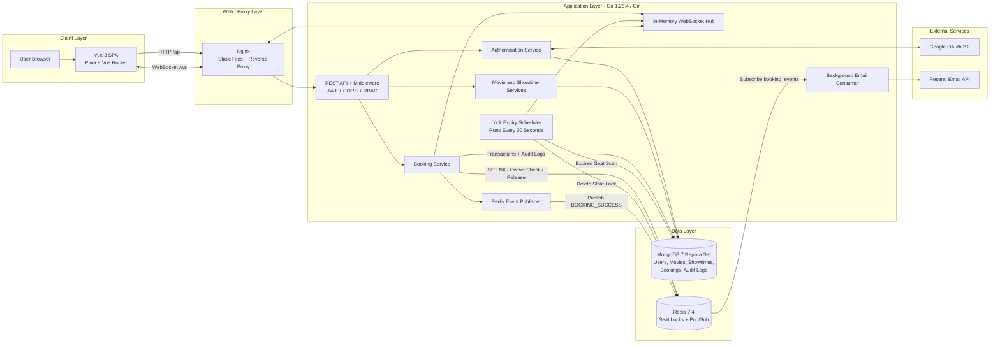
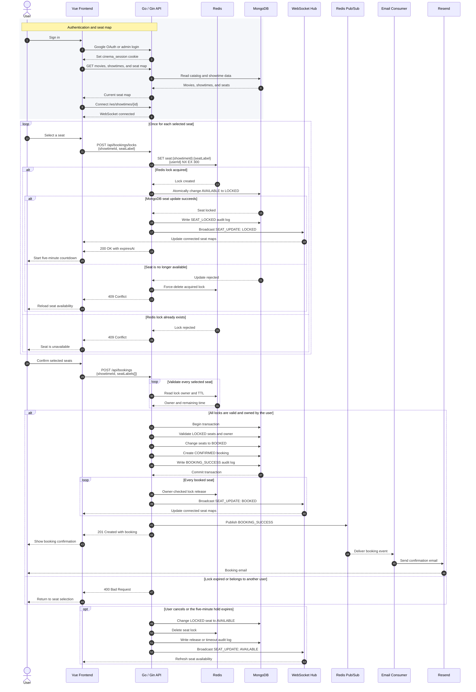

# Cinema Ticket Booking System

A full-stack cinema booking application built to handle concurrent seat selection safely. It combines Redis seat locks, MongoDB transactions, WebSocket updates, role-based access control, Google OAuth, and asynchronous booking emails.

## 1. System Architecture Diagram



Nginx serves the Vue single-page application and proxies `/api` requests to Gin and `/ws` connections to the WebSocket hub. The booking service coordinates Redis locks with MongoDB state. Successful bookings publish email events, while audit logs are written directly to MongoDB.

## 2. Tech Stack Overview

| Area | Technology | Purpose |
| --- | --- | --- |
| Frontend | Vue 3, TypeScript, Vite 8, Pinia, Vue Router | User and admin interfaces |
| Backend | Go 1.26.4, Gin 1.12 | REST API and application services |
| Database | MongoDB 7.0 replica set | Movies, showtimes, users, bookings, and audit logs |
| Lock and messaging | Redis 7.4 | Distributed seat locks and Pub/Sub events |
| Real-time updates | Gorilla WebSocket | Broadcasts seat status changes |
| Authentication | Google OAuth 2.0, JWT, HttpOnly cookie | User authentication and session management |
| Authorization | Custom RBAC middleware | Restricts admin routes to the `ADMIN` role |
| Email | Resend API | Sends booking confirmation emails |
| Frontend testing | Vitest, Vue Test Utils, Playwright | Unit, component, and end-to-end tests |
| Backend testing | Go testing package | Unit and integration tests |
| Containers | Docker Compose, Go 1.26 image, Node 24 image, Nginx | Reproducible builds and local services |

Local frontend development requires Node.js `^20.19.0` or `>=22.12.0`. The Docker frontend build uses Node.js 24.

## 3. Booking Flow



The lock endpoint accepts one seat per request, while booking confirmation accepts all selected seats in one transaction. A manual release happens immediately; expired MongoDB locks are cleaned by the scheduler every 30 seconds.

## 4. Redis Lock Strategy

Each seat uses a separate Redis key:

```text
seat:{showtimeId}:{seatLabel}
```

The value is the authenticated user ID. Lock acquisition is an atomic `SET NX` operation with a five-minute TTL:

```text
SET seat:{showtimeId}:{seatLabel} {userId} NX EX 300
```

- `NX` allows only the first concurrent request to create the lock.
- The 300-second expiry prevents abandoned seats from remaining locked permanently.
- MongoDB performs a second atomic status check before changing a seat from `AVAILABLE` to `LOCKED`.
- Booking confirmation checks both the Redis owner and remaining TTL, then validates MongoDB ownership again inside the transaction.
- Normal release uses a Lua check-and-delete script so one user cannot remove another user's lock.
- A scheduler scans MongoDB every 30 seconds, releases expired seats, removes stale Redis keys, writes a `BOOKING_TIMEOUT` audit log, and broadcasts the available status.

Redis is the fast concurrency guard, while MongoDB remains the durable source of truth.

## 5. Message Queue

Redis Pub/Sub is used only for asynchronous booking notifications:

1. A successful MongoDB transaction produces a `BOOKING_SUCCESS` event.
2. The publisher sends the event to the `booking_events` Redis channel.
3. A background consumer receives the event.
4. The consumer sends a booking confirmation through Resend.

Audit events such as `SEAT_LOCKED`, `SEAT_RELEASED`, `BOOKING_TIMEOUT`, `SYSTEM_ERROR`, and `BOOKING_SUCCESS` are written directly to MongoDB. They do not depend on the Pub/Sub consumer.

Redis Pub/Sub is fire-and-forget and does not persist messages. If the consumer is offline when an event is published, the email event can be lost. A production system requiring guaranteed delivery should use Redis Streams, RabbitMQ, or another durable queue.

## 6. How to Run

### Prerequisites

- Docker with Docker Compose
- Go 1.26.4 for local backend development
- Node.js `^20.19.0` or `>=22.12.0` for local frontend development

### Full System with Docker

Create the root environment file:

```bash
cp .env.example .env
```

Replace the example secrets as needed, then build and start all services:

```bash
docker compose up --build
```

- Application: [http://localhost](http://localhost)
- API: `http://localhost/api`
- WebSocket: `ws://localhost/ws/showtimes/{showtimeId}`

The backend is intentionally not published on host port `8080` in the base Compose configuration. Nginx proxies API and WebSocket traffic from port 80.

### Local Hot Reload

The development override publishes MongoDB and Redis only on `127.0.0.1`.

1. Create the root Compose environment and start the infrastructure:

   ```bash
   cp .env.example .env
   docker compose -f docker-compose.yml -f docker-compose.dev.yml up mongodb redis
   ```

2. In another terminal, configure and run the backend:

   ```bash
   cd backend
   cp .env.example .env
   go run ./cmd/main.go
   ```

   Set `MONGO_PASSWORD` and `REDIS_PASSWORD` in `backend/.env` to the same values as `MONGO_ROOT_PASS` and `REDIS_PASSWORD` in the root `.env`.

3. In another terminal, install frontend dependencies and start Vite:

   ```bash
   cd frontend
   npm ci
   npm run dev
   ```

Open [http://localhost:5173](http://localhost:5173). Vite proxies `/api` and `/ws` to the local backend at port `8080`.

### Verification Commands

Backend unit tests:

```bash
cd backend
go test ./...
```

The Redis concurrency integration test is skipped unless its connection variables are provided:

PowerShell:

```powershell
$env:TEST_REDIS_ADDR = "127.0.0.1:6379"
$env:TEST_REDIS_PASSWORD = "<same value as REDIS_PASSWORD in the root .env>"
go test ./internal/booking -run TestRedisLockAllowsOnlyOneConcurrentOwner -v
```

Bash:

```bash
TEST_REDIS_ADDR=127.0.0.1:6379 \
TEST_REDIS_PASSWORD='<same value as REDIS_PASSWORD in the root .env>' \
go test ./internal/booking -run TestRedisLockAllowsOnlyOneConcurrentOwner -v
```

Run the MongoDB repository integration test with credentials matching the root `.env`:

PowerShell:

```powershell
$env:TEST_MONGO_URI = "mongodb://<MONGO_ROOT_USER>:<MONGO_ROOT_PASS>@127.0.0.1:27017/cinema_test?authSource=admin&replicaSet=rs0&directConnection=true"
go test ./internal/booking -run TestMongoRepositoryIntegration -v
```

Bash:

```bash
TEST_MONGO_URI='mongodb://<MONGO_ROOT_USER>:<MONGO_ROOT_PASS>@127.0.0.1:27017/cinema_test?authSource=admin&replicaSet=rs0&directConnection=true' \
go test ./internal/booking -run TestMongoRepositoryIntegration -v
```

Replace the placeholders before running the commands. If a password contains URI-special characters, URL-encode it in `TEST_MONGO_URI`.

Frontend checks:

```bash
cd frontend
npm run test:unit -- --run
npm run build
npm run test:e2e
```

The E2E command starts or reuses the Vite server, but the backend, MongoDB, and Redis must already be running.

## 7. Assumptions & Trade-offs

- **Seed data:** An empty database is seeded with Hall A (30 seats), Hall B (40 seats), five movies, and four fixed daily slots (`Morning`, `Afternoon`, `Evening`, and `Night`) for five days.
- **MongoDB replica set:** Transactions require the single-node `rs0` replica set configured by Docker Compose.
- **Five-minute holds:** A fixed hold time keeps checkout simple but may need configuration for different products or traffic patterns.
- **Two-layer seat protection:** Redis reduces contention quickly, while MongoDB atomic updates and transactions protect durable booking state. This adds coordination between two data stores.
- **WebSocket scaling:** The hub is stored in one backend process. Multiple backend replicas would need a shared event layer so clients connected to different replicas receive the same updates.
- **Pub/Sub reliability:** Redis Pub/Sub is lightweight but can lose notification events while consumers are unavailable.
- **Optional integrations:** Google OAuth is optional for admin-only local testing. When `RESEND_API_KEY` is empty, email delivery is mocked and written to application logs.
- **Local security:** Development uses `COOKIE_SECURE=false` over HTTP. Production should use HTTPS, strong secrets, trusted origins, and `COOKIE_SECURE=true`.
